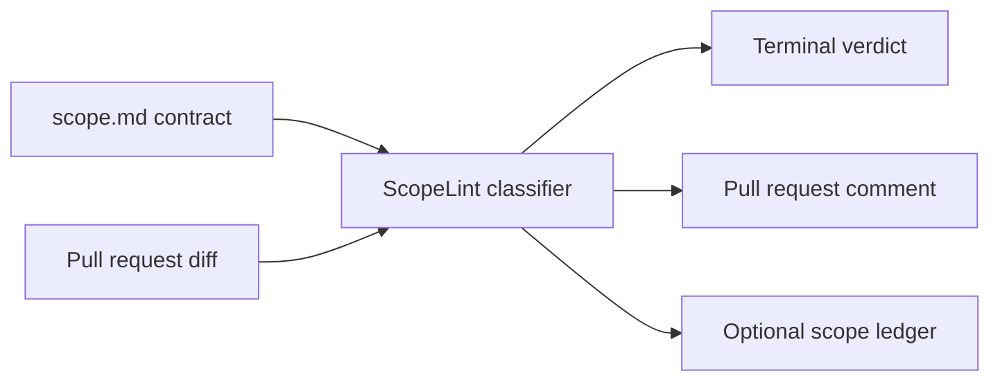

# ScopeLint

ScopeLint lints code changes against the contract. It compares a pull-request diff with the repository's `scope.md` statement of work, classifies each functional area as in scope, out of scope, or a gray area, and drafts a client-ready change order when work falls outside the agreement.

## The problem

Scope creep quietly erodes project margins: teams do useful work that was never priced, while clients lose a clear record of what changed. ScopeLint makes the contract part of pull-request review, so questionable work is visible before it is merged.

## Quickstart: replay mode (no API key)

```sh
git clone <owner>/scopelint
cd scopelint
npm install
npx scopelint init
npx scopelint check --diff-file fixtures/diffs/pr2-admin-dashboard.diff --replay
```

Replay mode reads the canned response paired with the diff filename, so it is useful for demos and CI-free evaluation. The final command prints an out-of-scope verdict and a draft change order without contacting the OpenAI API.

## Live mode setup

Create a local `.env` file (it is ignored by Git) with your API key:

```text
OPENAI_API_KEY=your_key_here
```

Then run a live check:

```sh
npx scopelint check --diff-file fixtures/diffs/pr2-admin-dashboard.diff
```

ScopeLint uses `gpt-5.6-terra` by default. Pass `--model <id>` to choose a different compatible model.

To run ScopeLint automatically for pull requests, grant the workflow permission to update pull-request comments:

```yaml
name: ScopeLint
on: pull_request
permissions:
  pull-requests: write
  contents: read
jobs:
  scopelint:
    runs-on: ubuntu-latest
    steps:
      - uses: actions/checkout@v4
      - uses: <owner>/scopelint@main
        env:
          OPENAI_API_KEY: ${{ secrets.OPENAI_API_KEY }}
          GITHUB_TOKEN: ${{ secrets.GITHUB_TOKEN }}
```

The action fetches the pull-request diff, posts one marked ScopeLint comment, and updates that same comment on later runs. Use its `scope-path`, `fail-on`, and `model` inputs as needed.

## Demo repository walkthrough

`scopelint-demo-acme` is the companion Express API project. Its staged pull requests demonstrate an in-scope points-accrual feature, an out-of-scope admin analytics endpoint, and a mixed accrual/payment-adapter change. The exported diffs and replay responses live in this repository under `fixtures/`.

The demo project is available beside this repository at `../scopelint-demo-acme`, with these branches ready to open as pull requests:

- `feat/points-accrual-engine`
- `feat/admin-analytics-dashboard`
- `fix/accrual-rounding-payment-adapter`

## How it works



## Built with Codex and GPT-5.6

> Placeholder: add the build-session prompts used for the final release.

> Placeholder: add screenshots of the replay CLI output and the GitHub pull-request comment.

## Roadmap

- Hosted dashboard and multi-repository views
- Authentication and persistent hosted storage
- Jira and Slack integrations
- IDE extensions
- Team analytics for recurring out-of-scope work

## License

MIT. See [LICENSE](LICENSE).
